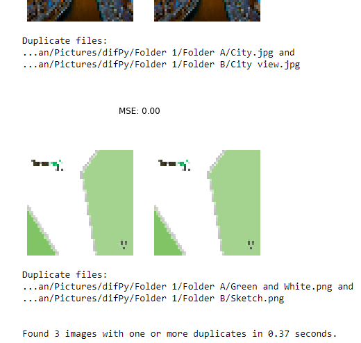

# Duplicate Image Finder (DIF)
**Tired of going through all images in a folder and comparing them manually to check if they are duplicates?**

:white_check_mark: The Duplicate Image Finder (DIF) Python script **automates** this task for you!

## Description
The DIF searches for images in a specified target folder. It then compares the images it found and checks whether these are duplicates. The DIF then outputs the **image files classified as duplicates** and the **filenames of the images having the lowest resolution**, so you know which of the duplicate images are safe to be deleted.

<p align="center">
  
</p>

## Basic Usage
Use the following function to make DIF search for duplicates in the specified folder:

```python
compare_images("C:/Path/to/Folder/")
``` 
Folder path must be specified as a Python string.
## Additionnal Parameters

```python
compare_images(directory, show_imgs=True, similarity="high", compression=50)
```

### show_imgs (bool)
Per default, DIF outputs a sample of the duplicate/similar images it found.

```True``` = shows the duplicate/similar images DIF found in output

```False```= doesn't show found images

### similarity (str)

Depending on the use-case, DIF can search for duplicate images or images that look similar (but are not necessarily duplicates).

```"high"``` = searches for duplicate images
                           
```"low"``` = searches for similar images

### compression (int)

**Recommended not to change default value**

Absolute compression in px (width x height) of the images before being compared.
The higher the compression, the more computational ressources and time required.     
                           
