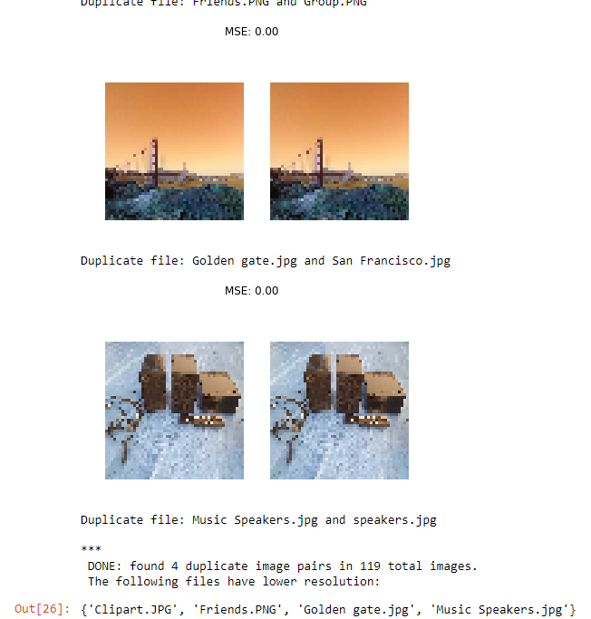

# Duplicate Image Finder (DIF)
Tired of going through all images in a folder and comparing them manually to find if they are duplicates?
The Duplicate Image Finder (DIF) Python script automates this task for you!

Select which file folder the DIF should search through, and it will will compare all images in that folder whether these are duplicates, or not. 
It outputs all images it classifies as duplicates including the filename of the image having the lowest resolution of both, so you know which of the two images is safe to be deleted.

<p align="center">
  
</p>

## Basic Usage
Use the following function to make DIF search for duplicates in the specified folder:

```python
compare_images("C:/Path/to/Folder/")
``` 

## Additionnal Parameters

```python
compare_images(directory, show_imgs=True, similarity="high", compression=50)
```

```directory``` (str)..... folder to search for duplicate/similar images

```show_imgs``` (bool).... True = shows the duplicate/similar images DIF found in output
                           False = doesn't show found images
                           
```similarity``` (str).... "high" = searches for duplicate images
                           
                           "low" = searches for similar images
                           
```compression``` (int)....recommended not to change default value
                           compression rate in px of the images before being compared
                           the higher the compression, the more computational ressources and time required                          
