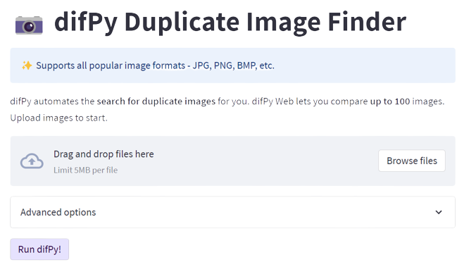
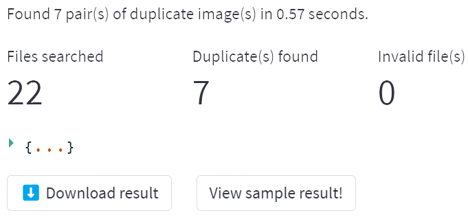

difPy Web App
=====

Not familiar with coding? **You can now use difPy through its web app**!

📱 **Try the** `difPy Web App`_.

.. _difPy Web App: https://difpy.app

The difPy Web App is based on `difPy`_, a Python-based package that automates the **search for duplicate/similar images**.

.. _difPy: https://github.com/elisemercury/Duplicate-Image-Finder

.. _Use the difPy App:

Using the difPy Web App
------------

To search for duplicate images with the difPy web app, start by **uploading the images** you would like to compare. After the images have been uploaded, click "Run difPy!" to make difPy do its magic.

   `difPy Web App`_ Interface

difPy Web will scan the uploaded images for duplicates (or similar images) and will let you download a ZIP file of all your deduplicated files! ✨

   `difPy Web App`_ Result

Additional Options
------------

The difPy search algortihm can be customized by adjusting the additional options.

Fast Search (FSA)
^^^^^^^^^^
difPy web can leverage difPy's **Fast Search Algortihm (FSA)** for increased performance when searching for  duplicate images. FSA can not be enabled when searching for similar images. 

More information on FSA can be found in the :ref:`Fast Search Algorithm (FSA)` section.

Similarity
^^^^^^^^^^
difPy web can search for **duplicate or similar** images within the uploaded files. By default, difPy will search for duplicate images. Select "similar" to search for similar images. 

More information on similarity can be found in the :ref:`similarity` section.

Pixel Size
^^^^^^^^^^
.. note::

   Recommended not to change default value.

The pixel size is the absolute **size in pixels** (width x height) the images will be resized to before being compared. This is done to speed up the comparison process. The higher the pixel size parameter, the more computational ressources and time required. The lower the pixel size parameter,  the faster, but the more imprecise the comparison process gets.

More information on FSA can be found in the :ref:`px_size` section.

Limitations
------------

Some limitations of the difPy web app include:

* A maximum of **100 images** can be uploaded and compared an once.
* Please ensure all uploaded files have a **unique filename**. If two files are uploaded that have the same filename, difPy web will overwrite them when uploaded. This applies even if the files are located in different folders in the source.
