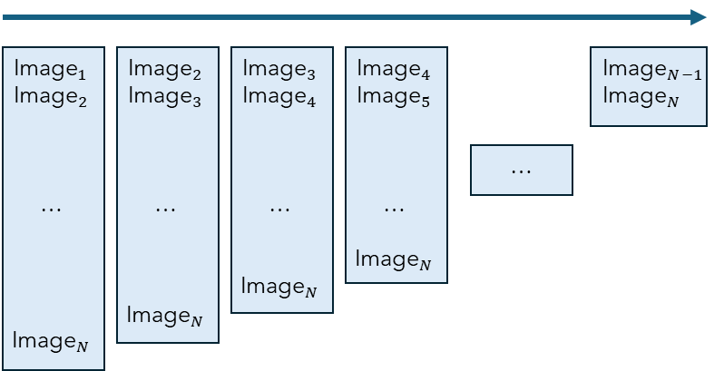

FAQ
=====

.. _faq:

.. _Using difPy with Large Datasets:

Using difPy with Large Datasets
----------------

Starting with `v4.1`_, difPy handles small and larger datasets differently. Since the computational overhead and especially memory consumption can become very high on large image datasets, difPy utilizes a different algorithm specifically to process larger datasets more efficiently and less memory intensive. 

.. _v4.1: https://pillow.readthedocs.io/en/stable/handbook/image-file-formats.html

When difPy received a dataset of **5k images or less**, difPy uses its Classic algorithm and compares **all image combinations at once**, hence all of the image data is loaded into memory. This can speed up the comparison processing time, but in turn is heavier on memory consumption. Therefore, this algorithm is only used on "small" datasets.

   Classic algorithm visualized

When difPy receives a dataset that contains **more than 5k images**, images are **split into smaller groups** which are processed one-by-one leveraging `Python generators`_. This leads to a significant reduction in memory overhead, as only a single smaller chunk is loaded into memory once at a time, as compared to the full list of all potential image comparison combinations. Furthermore, images are compared leveraging vectorization which also allows for faster comparison times on large datasets. 

.. _Python generators: https://docs.python.org/3/reference/expressions.html#yield-expressions

   Chunking algorithm visualized

The picture above visualizes the chunks that are processed one-by-one by the Chunking algorithm. Each of the columns represent a chunk (a group) of images. 

The ``chunksize`` parameter sets how many of these chunks will be processed at once (see :ref:`chunksize`). By default, ``chunksize`` is set to ``None`` which implies: ``1'000'000 / number of images in dataset``. This ratio is used to automatically size the ``chunksize`` according to the size of the dataset, with the goal of keeping memory consumption low. This is a good technique for datasets smaller than 1 million images. As soon as the number of images will reach more, then heavier memory consumption increase will become inevitable, as the number of potential image combinations (matches) becomes increasingly large. It is **not** recommended to adjust this parameter manually.

.. _What's new in v4?:

What's new in v4?
----------------

difPy version 4 is the next-generation version of difPy, which not only achieves **up to 10x the performance** compared to version 3.x, but also comes with a variety of **new features** that make its usage experience even better.

**Splitting of Processes**

difPy has been split into two main processes: first building the image repository with image tensors, and finally executing the search. This means that you will only have to build the image repository once, to then perform multiple search tests on the same repository.

For example, first we can build the ``dif`` object:

.. code-block:: python

   import difPy
   dif = difPy.build("C:/Path/to/Folder/")

And then we can perform two different searches on the same ``dif`` object:

.. code-block:: python

   search_duplicates = difPy.search(dif, similarity="duplicates")
   search_similar = difPy.search(dif, similarity= "similar")

**Multiprocessing**

One of the most significant changes to version 4 is the implementation of multiprocessing. difPy leverages Python's multiprocessing capabilities for both the ``difPy.build`` part and the ``difPy.search`` part. This leads to massive performance increases on large datasets, especially for tasks like image tensor generation and computation of the MSEs.

In a test on a folder containing **6k images**, including 3k duplicates, difPy needed on average **4min** in total. Approximately 46% of total time were spent on building the image repository, and 55% on the search. That is **10x as fast as previous difPy versions** on the same dataset and machine.

**New Feature: In-Folder Search**

difPy now allows for searching for matches within folders separately, additionally to searching among the union of all images found. 

To highlight what this means in an example. If we had a folder structure as shown below:

.. code-block:: console

    .
    |- Folder1
    |  |-image1_1.jpeg
    |- Folder2
    |  |-image2_1.jpeg
    |-image.jpeg

We can run difPy on the main folder with the  :ref:`in_folder` parameter set to ``True``:

.. code-block:: python

   import difPy
   dif = difPy.build("C:/Path/to/Folder/")
   search = difPy.search(dif, in_folder=True)

difPy will then initiate a search for each separate folder considering them as separate search groups. It will search for matches among the main folder, in Folder1 and in Folder2.

**difPy is more Lightweight**

difPy is now much more lightweight by depending less on external packages, and more on Python native features. Moreover, difPy processes certain functions more efficiently thanks to increased usage of `Numpy <https://www.geeksforgeeks.org/why-numpy-is-faster-in-python/>`_.

.. _Supported File Types:

Supported File Types
----------------

difPy supports most popular image formats. Nevertheless, since it relies on the Pillow library for image decoding, the supported formats are restricted to the ones listed in the `Pillow Documentation`_. Unsupported file types will by marked as invalid and included in the process statistics output under ``invalid_files`` (see :ref:`Process Statistics`).

.. _Pillow Documentation: https://pillow.readthedocs.io/en/stable/handbook/image-file-formats.html

.. _Report a Bug:

Report a Bug 🐛
----------------

Should you encounter any issue or unwanted behavior when using difPy, `you can open an issue here <https://github.com/elisemercury/Duplicate-Image-Finder/issues/new/choose>`_.

.. include:: /reusables/support_difpy.rst