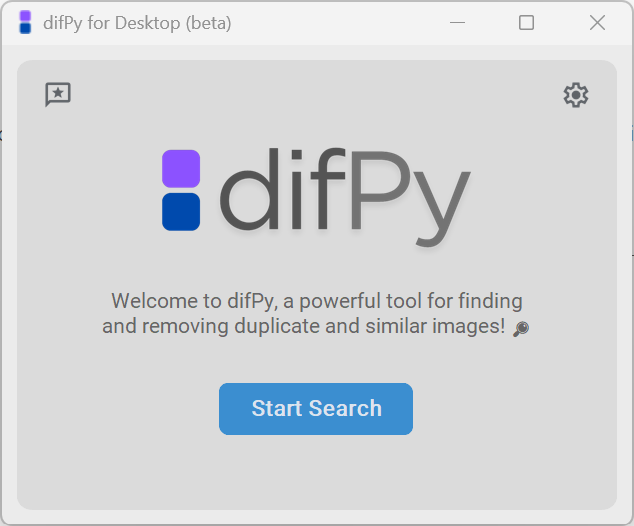

.. _desktop:

.. note::
    ✨🚀 difPy for Desktop (beta) is now available for download in the `Microsoft Store <https://go.difpy.app/desktop>`_ !.

difPy for Desktop
----------------

difPy for Desktop brings difPy's image deduplication capabilities as an intuitive, easy to use app to your desktop.

Unlike most deduplication software, difPy does **not** compare images based on their hashes - it compares them based on their **image tensors** (i. e. the actual image content). This allows difPy to not only search for exact **duplicate images**, but also for **similar images** (which can be very useful if duplicate images have different file extensions, or if images are cropped versions of one another).

.. _dsk_installation:

Installation
^^^^^^^^^^

➡️ `Download the difPy v1.0-beta app for **Windows** <https://go.difpy.app/desktop>`_ .

➡️ Download the difPy v1.0-beta app for **MacOS** (*coming soon*)

.. _dsk_basic_usage:

Basic Usage
^^^^^^^^^^

To start a new search, open the difPy for Desktop app and click the "Start Search" button on the main menu. The search process is divided into two steps: (1) import folders and (2) configure search.

   difPy Main Menu

.. _dsk_import:

Import Folders
++++++++++++

You can import **one or more folders** at once by clicking the "Browse" button. Alternatively, you can also paste folder paths (separated by a semicolon ";") directly into the text box.

The following import modes are supported:

* **Recursive**: defines whether difPy should search through the subfolder(s) of the imported folder. If selected, difPy will search for matches in all subfolders.

* **In-folder**: defines whether difPy should treat each folder as separate and only search for matches among the folder itself. If selected, difPy will treat the folders as separate. **Can only be selected if at least 2 folders have been imported**.

Additionally, you can configure the following advanced import settings:

**Pixel size**: defines the width and height to which the images are compressed to before the search (default value is 50). The higher the pixel size, the more precise but the slower the search. **It is recommended not to change the default value. Only change this value if you know what you are doing**. If you would like to improve the precision of the search (f. e. when you are searching for matches among images that contain text), it is recommended to increment this value by steps of 50. 

.. _dsk_search:

Configure Search
++++++++++++

After importing the folder(s), you can configure what type of similarity search difPy should perform. difPy can search for:

* duplicate or

* similar images

**Duplicate**: when the search is set to "duplicates", difPy searches for **exact image matches**. The result will only contain matches of images that are exact duplicates of each other. Whenever you are searching for duplicate images with different file formats (i. e. imageA.png is a duplicate of imageB.jpg), it is recommended to set the search similarity to "similar".

**Similar**: when the search is set to "similar", the results will include **duplicate and similar image matches**. 

.. note::
    **How does similarity search work?**

    difPy compares the images pixel by pixel and calculates the Mean Squared Error (MSE) between the images. The MSE is a measure of the similarity between two images. The lower the MSE value, the more similar the images are. When similarity is set to "duplicates", difPy will only return matches with an MSE value of 0. When similarity is set to "similar", difPy will return matches with an MSE value of 5 or lower. Currently the similarity MSE value can not be customized in the desktop app. If you need a different MSE value, please use the `difPy Python package <https://pypi.org/project/difPy/>`_.

Additionally, you can configure the following advanced search settings:

**Rotate**: if selected, difPy will rotate the images by 90°, 180°, or 270° at each comparison. This is useful if you know that the duplicate/similar images you are looking for are rotated.

**Same dimensions**: if selected, difPy will only compare images with the same dimensions. This is useful if you know that the duplicate/similar images you are looking for are of the same dimensions and will hence speed up the comparison process significantly. Turn this off if you are searching for images that are of different file types (i. e. imageA.png is a duplicate of imageB.jpg).

.. _dsk_results:

Search Results
++++++++++++

When difPy has completed the search, the search results will be displayed, incl. the number of duplicate and/or similar matches it found.

You can then:

* **View/manage the search results** in the **difPy Image Viewer** (see :ref:`dsk_image_viewer`).

* **View the search logs** for more information about the search process.

.. _dsk_image_viewer:

Image Viewer
^^^^^^^^^^

The difPy image viewer allows you to view the duplicate/similar images and easily manage them. The Image Viewer lets you go through each group of matches and see the resolutions of each of the images so that you know which ones are safe to be moved or deleted. 

For each image, you have the option to **open it**, **move it** to a new location, or **delete it**.

If you want to **move or delete all** lower resolution matches at once, you can use the "Bulk Actions..." dropdown menu and select the bulk action you would like to take.

.. _dsk_advanced_settings:

Advanced Settings
^^^^^^^^^^

From the difPy settings on the main menu, you can access advanced search settings. 

.. warning::
    It is not recommended to change these settings unless you know what you are doing. See :ref:`Adjusting processes and chunksize`.

**Processes**: defines the maximum number of worker processes (i. e. parallel tasks) to perform when multiprocessing. The more processes, the faster the search, but the more processing power (CPU) the app will use. See :ref:`processes` for more information.

**Chunksize**: defines the number of image sets that should be compared at once per process. The higher the chunksize, the faster the search, but the more memory (RAM) the app will use. See :ref:`chunksize` for more information.

The ``process`` and ``chunksize`` become relevant if difPy received more than 5k images to process. With large datasets, it can make sense to adjust these parameters. For example, in order to lower the overall CPU overhead, you could lower ``processes``. In order to decrease memory usage, you could decrease ``chunksize``. The higher both parameters, the more performance you will gain, but the more resources the app will use. See :ref:`Adjusting processes and chunksize` for more information.

.. _dsk_limitations:

Limitations
^^^^^^^^^^

* Using the difPy desktop app for large datasets can lead to slower processing times. For better performance, with large datasets (> 10k images) it is recommended to use the `difPy Python package <https://pypi.org/project/difPy/>`_ instead.

* Depending on the size of your dataset, difPy will require more or less processing power and memory. If you are running difPy on a low-end computer, it may take a while to process a large dataset. It is recommended to have at least 8GB of memory for difPy for Desktop to run smoothly.

* The desktop app is currently only available to beta testers on Windows.

* The desktop app is currently in beta and may contain bugs. If you encounter any issues, please report it. See :ref:`dsk_feedback`.

.. _dsk_feedback:

Give Feedback / Report Bug
^^^^^^^^^^

🐞 Did you encounter an issue with the difPy desktop app? `Report it here <https://go.difpy.app/desktop-bug>`_.

🗨️ Do you have feedback about the difPy desktop app? `Share your feedback here <https://go.difpy.app/desktop-feedback>`_.